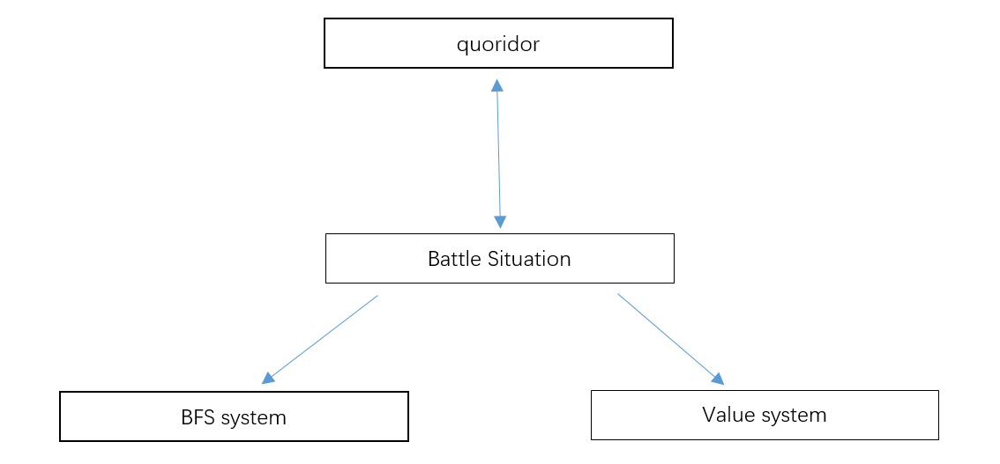

---

---

# Quoridor

2017SJTU ACM大作业试验robot

## 游戏规则和提交方法

详见Quoridor_manual

## 游戏设计

### 游戏规则及其难点的分析

该游戏中有这样一个规则，在放墙的时候不能将对方的路完全封死，这应该BFS能搞定

以及大助教对于一次操作只能在1s内，我们的博弈树的层次不能太大，且我们要想尽可能的让博弈树深度加大，就得使用αβ剪枝。

### 游戏操作

我们用一个class quoridor来完成返回一个pair给平台

我们的大致框架为：



quoridor的声明如下：

```c++
class quoridor{
public://只是为了长期保存棋盘的现状
	int board[20][20];//简单的记录是否有墙
	int rest_of_my_wall;
	int rest_of_an_wall;
	pair<int, int > my_pos;//记录我方位置
	pair<int, int > an_pos;//记录敌方位置
	quoridor() {}
	~quoridor() {}
	pair<int, int> action();//返回行动位置
	void update_out(pair<int, int>point);//对于位置的更新


private:
	struct battleSituation
	{
		int depth;
		int alpha;
		int beta;
		int value;
		struct battlesNode {
			int if_wall;//if_wall的原型就是quoridor里的board
			int dijkstra_value;//添加dijkstra_value是为了dijkstra时的比较
			//pair<int, int> pre;这个pre是为了后面赋值函数的
		};
		battlesNode wall_board[20][20];//意思是主要是看墙的放法的
		pair<int, int> my_now_pos;
		pair<int, int> an_now_pos;
		void dijkstra(pair<int ,int> point); //dijkstra用于赋值和判断时候还有路
		bool noway();//放墙的时候的问题，符合规则不能无路可走
		int rest_of_my_wall;
		int rest_of_an_wall;
		void addvalue();
		bool knock_wall(int m, int n);
	};
	int gamesort(battleSituation now);
	//4 directions and 17*8 postions setting wall,I choose use stack to save space.
	//the depth is 4 
	battleSituation pre_sort(int m);//拷贝一个现在的环境给battleSituation
};
```

### 博弈树系统

本系统的博弈树只有三层0，1，2。因为我们可能的行为只可能最多有132种（4种行走操作，128种放墙操作）

我们在最开始就将120种操作存在maybeact数组中，方便后面能使用，我们使用BFS，满足最大最小搜索，每一层向上返回一个值，是最大值还是最小值通过depth确定，我们定义了final choose储存一个maybeact的下标，方面我们后期向judge输出，我们在第一层的遍历的时候在层间值改变时，也得把final choose 改变。

第二层的函数直接返回一个数值，是对那个状态下的棋盘进行评估，这要启动赋值系统

### 赋值系统

这个地方最让人担心的就是墙赋值系统和行进赋值系统两者之间的关系，不能太过“限制”或者“偏袒某一方”，我们这个地方是对整个棋盘进行评估，自然是双方都要评估，至于说是两方在数值上是不是有不同，我们后期再来讨论

#### 墙赋值系统

只能在能放墙的地方放墙，这个地方有个小的隐藏的bug，就是你之前可能在(14,7)这个位置放了墙，但后面遍历(12,7)的时候你回溯把(14,7)这个墙点也回溯了，很可能导致放墙的时候重复放墙。

放墙得考虑墙的数量，墙的位置，之前在主写BFS的时候对于墙的考虑似乎是少了很多，只是想用一个反比例函数去描述。当时想的是，行进赋值系统中做Dijkstra会体现我们放墙的价值，似乎就不需要单独再体现墙的问题了，但最终的结果不如人意。我们还是要对放墙，和墙的位置进行强调。

#### 行进赋值系统

赋值函数的几个重点：

敌我离的终点的距离（最短路）;

这个距离对应一个类似于反比例函数（对敌），最后作差得到该结果的价值

博弈树的实现我们就在新的棋盘里面来写，因为我们要保存一些棋盘情况的value
